# Your copy is diagnostic

Product team offsite, March 17, 2026

Justin Gagne, Senior UX Writer<br>
`justin.gagne@apify.com`

---

## I Write, I Build

Hi, I’m Justin Gagne. Senior UX Writer at Apify.

I write, design, and build for the web.

I believe writing is designing.

---

## Pull, Write, Push

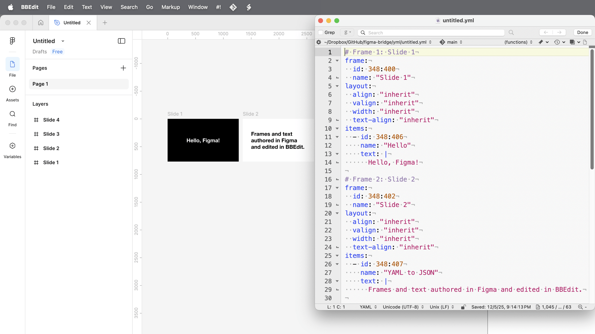

**In development:** A Figma plugin that enables JSON-to-YAML conversion and copy editing in BBEdit.

---

## Bad copy doesn’t cause problems

*It reveals them.*

---

## When copy is broken, something upstream is broken

The copy is where the problem becomes visible.

---

## Three patterns, and one exercise

1. Copy that stops you
2. Copy that confuses you
3. Copy that needs care
4. TK: Exercise and discussion

---

## Copy that stops you

*When the design makes one option feel inevitable.*

---

## The copy you had to choose

When the design makes one option feel inevitable.

✘ You cannot continue without signing in.

✔ Sign in to continue.

---

## Detour ahead

You just wanted to listen.

---

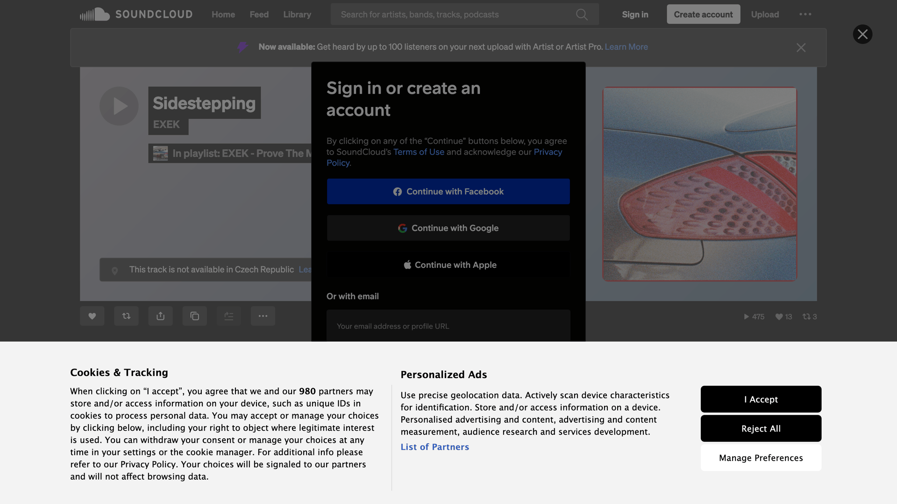

---

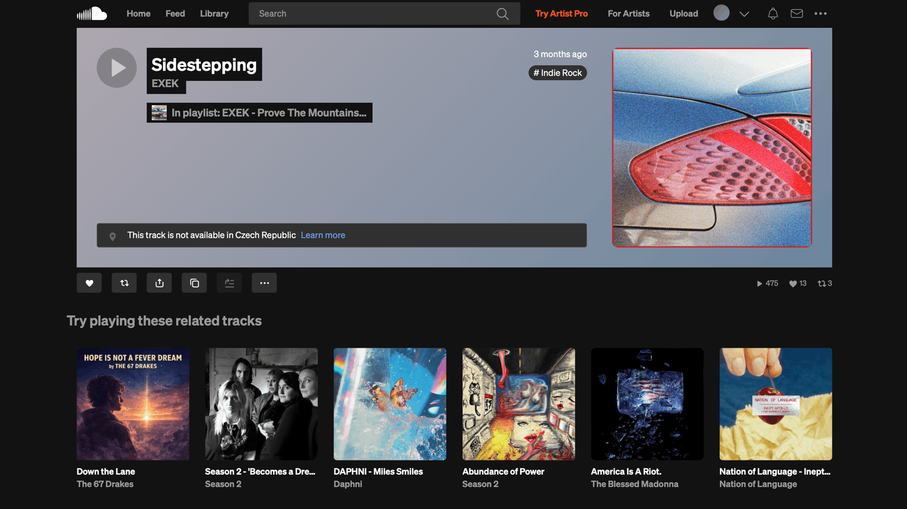

---

## Not available

You accepted the cookies. You signed in. You clicked through.

> This is not available in Czech Republic

The copy didn’t lie. It just waited until after maximum investment to tell the truth.

---

## 🍪 You go to a bakery to get a cookie

Before you see the menu, you’re handed a contract.

You skim it, hit accept, and sit down.

---

## 🍪 This bakery uses cookies

We and our 512 partners may store and/or access information on your device…

[ I Accept ] [ Reject All ]

Two minutes later you realize there was a Reject All button the whole time.

---

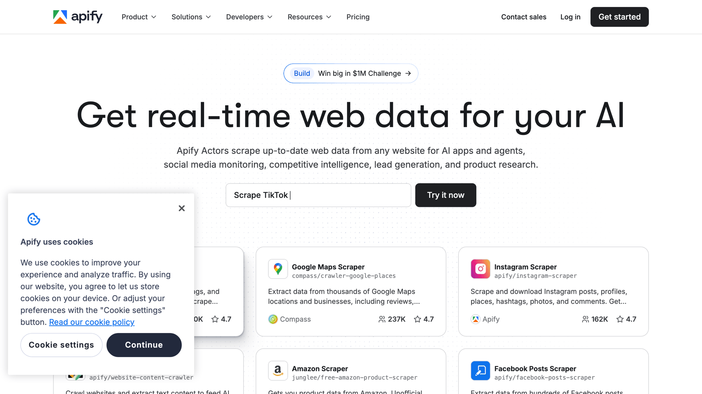

---

## Severity: Low

Reject is hidden. You can still get in. But the copy chose for you.

“Cookie settings” hides the reject path.

<!-- The cookie choice was intentional. The team needed tracking data. That’s a real business need. The diagnostic question isn’t whether it was wrong. It’s: is there a middle ground? The next slides show one. You can get the data and let the user know it’s a choice. Those aren’t in conflict. -->

---


---

## This is fine

You accepted.

You sat down.

Everything seems okay.

---

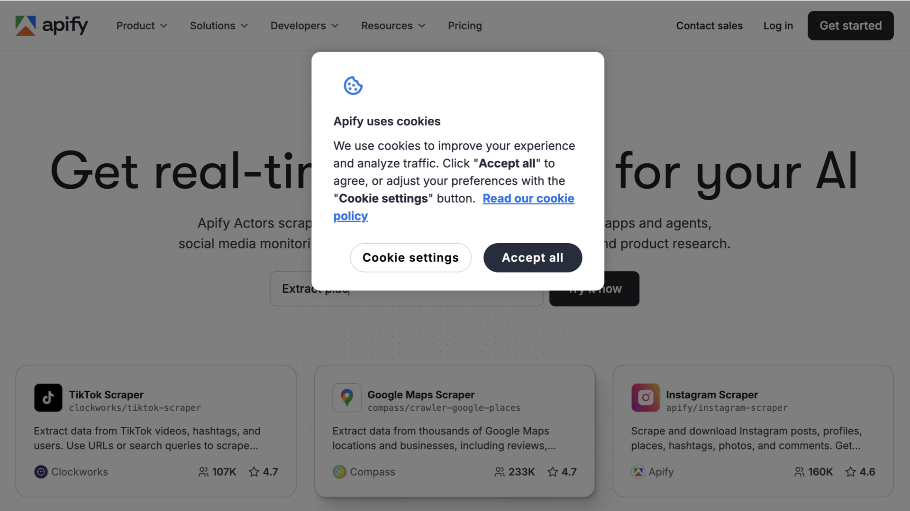

---

## Severity: High

Dark overlay. Full block. No reject option at all. You cannot get in.

In the EU, this violates GDPR and ePrivacy law. The banner may also fail accessibility requirements.

---

## Recognize this pattern?

- It wasn’t written for you.
- It was written to satisfy a legal requirement.
- It was written so yes felt easier than no.

---

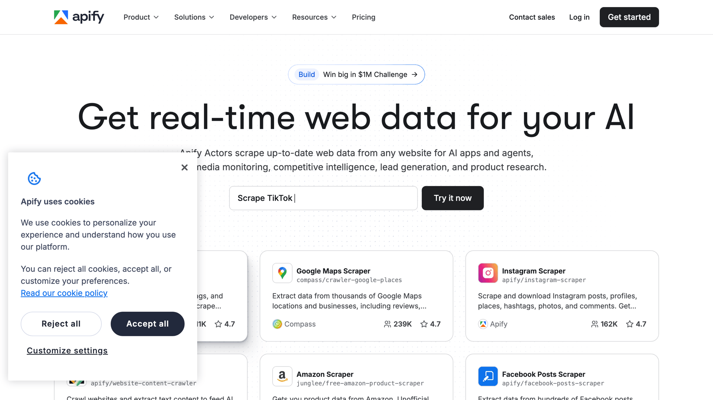

---

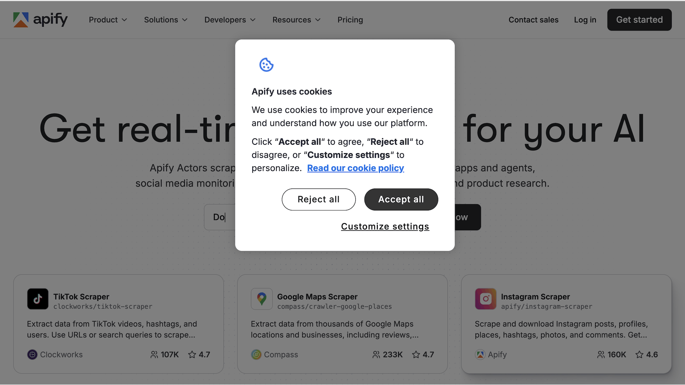

---

## The words should feel face-to-face

| RTFM | Direct | Human |
|---|---|---|
| [ Cookie settings ] | [ Decline ] | [ No, thanks ] |
| Makes me work to say no. | Polite, precise, no drama. | What you’d actually say. |

---

> **Be genuine: write authentically, as if talking to someone face-to-face.**
>
> — Apify style guide

---

## Same fix, two contexts

The copy isn’t hiding the choice anymore.

**Diagnostic:** If your copy stops a user, the product stopped them first. Ask why.

---

## Copy that confuses you

*When nobody agreed on the words.*

---

## When nobody agreed on the words

You’ve read both of these. One felt wrong.

✘ Select the button. Check the box.
✔ Click the button. Select the checkbox.

---

## The convention exists

| Verb | Component |
|---|---|
| click / tap | buttons |
| choose | drop-down menus |
| select / deselect | checkboxes and radio buttons |
| follow / open | links |

The verb should match the element. If it doesn’t, someone made a choice, or didn’t.

The table tells you which word to use.

---

## We had a convention

Then the web decided conventions were boring, and native apps followed.

---

Radio buttons with checkmarks inside.<br>*Twitter (2024)*


---

Round checkboxes. A 40-year convention, broken.<br>*Apple visionOS (2024)*


---


*Jinkies. It was the convention, the whole time.*

---

## How are people supposed to know?

| click | select | choose | submit |
|---|---|---|---|
| button? | checkbox? | dropdown? | button? |

Four words, four junctions. If they all lead somewhere different, people guess.

---

## The convention still exists

The convention was documented. It was always there.


*Mac OS 7.5 (1994)*

---

## It’s not just checkboxes.

---


---

## Okay, I signed in. Now what?

---

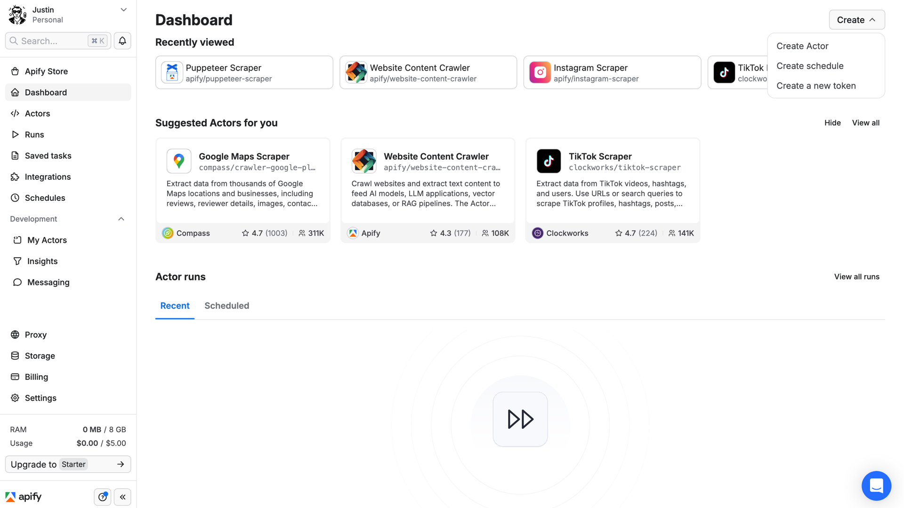

---

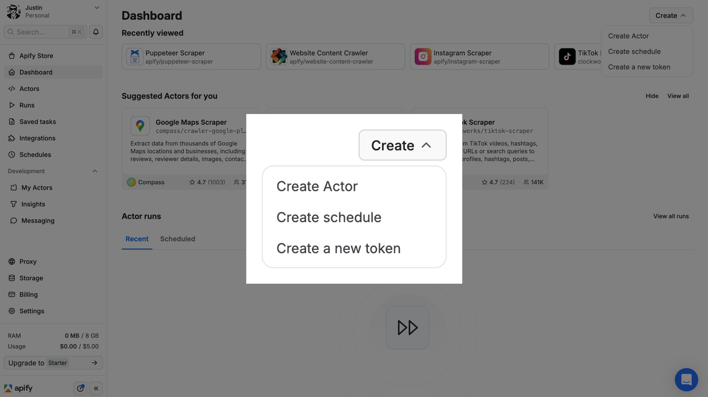

---

## We fixed the label

**Create ↓**
- Create Actor
- Create schedule
- Create a new token

The button knew. It didn’t finish the sentence.

We retired “Click Here.” Then we shipped “Create.”

We fixed the label. But we didn’t finish the sentence.

---

## Recognize this pattern?

- You’ve used three words for the same button.
- Nobody agreed on which one was right.
- We decided not to show the options. We hid them instead.

---

> **Be specific: avoid vague statements. Explain clearly and directly.**
>
> — Apify style guide

---

## Finish the sentence

| Too vague | Specific |
|---|---|
| Learn more | View Actor details |
| Get started | Get started free |
| Try it | Run this Actor free |

**Diagnostic:** If the verb feels off, ask who decided.

---

## Copy that needs care

*It ships, gets forgotten, and becomes your product voice by accident.*

---

## Every team has a name for it

TK is one name.

TK comes from print journalism, "to come." The K is intentional.
TK almost never appears in English naturally. Easy to search, no false positives.

---

## To do, to come

```
// TODO: add error message for failed payment
TK: error message copy (2 lines max)
To come: onboarding tooltip
[Amount label] <- needs final copy before launch
```

The notation changes. The problem doesn’t.

---

## You left, the UI forgot

---

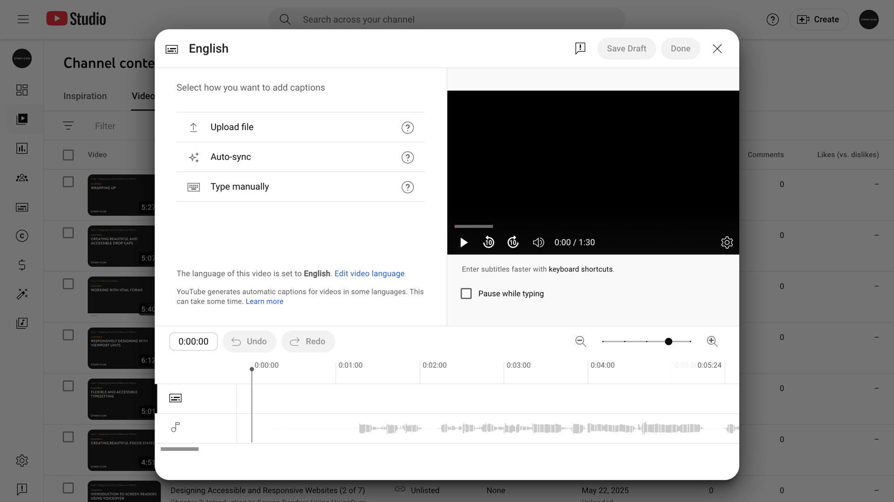

---

## The UI said nothing.

You were mid-task. A Slack message came in. You came back.

The filename was hidden. You had to piece together where you were.

---

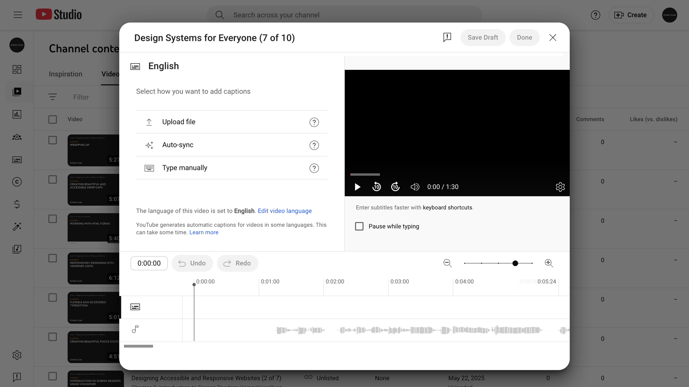

---

## The copy wasn’t there.

The information existed. The copy wasn’t there to hold your place.

---

## Okay, I wasn’t ready to Create. Let me try an Actor

---

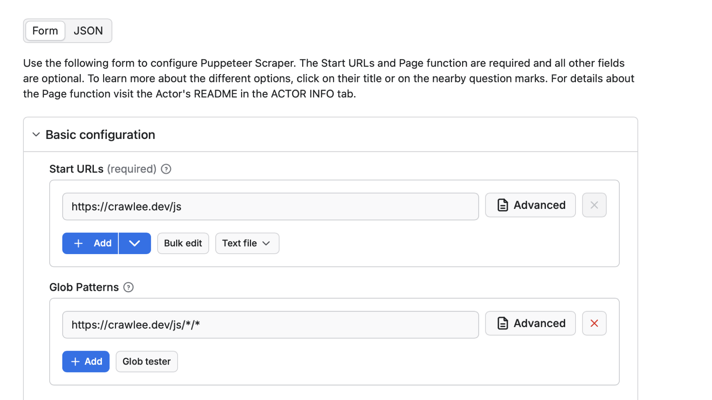

---

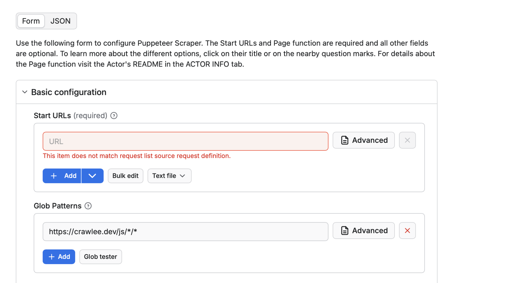

---

## Error

You removed it. You typed your URL. You hit run.

Error. Red field. A message that describes the problem but doesn’t solve it.

---

## The ⓘ tooltip was there the whole time

---

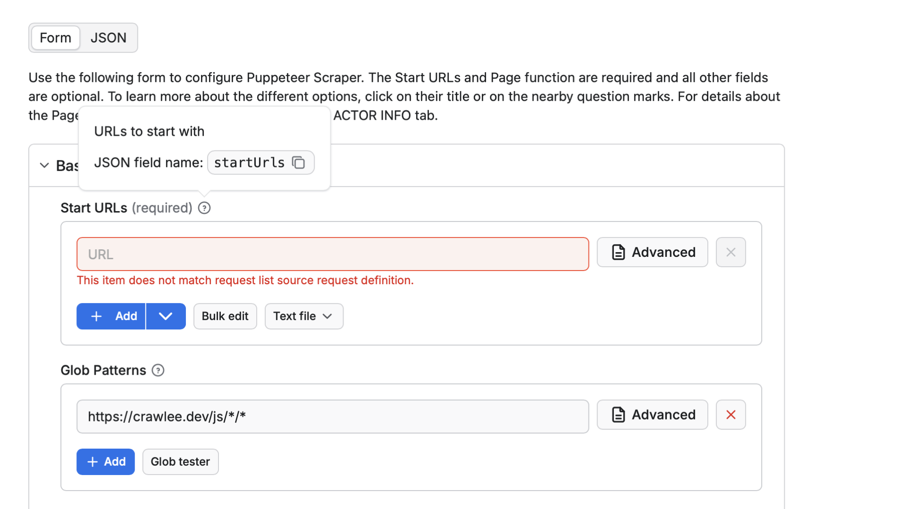

---

## You never clicked it.

You thought you knew what to do.

The placeholder looked like guidance. It wasn’t.

Now I don’t know if I want to work this hard.

---

## Not all placeholders are TKs

Some ship on purpose. They’re just as harmful.

Gray means disabled. Placeholder text is grey with poor color contrast by default.

- Gone when you need it most
- Breaks screen readers
- Mistaken for pre-filled data

---

## Recognize this pattern?

- The copy was there.
- Then it wasn’t.

---

> **It’s okay to repeat the same phrases or names for the same things — actually, it’s the preferred way. This is not poetry.**
>
> — Apify style guide

---

## The issue closed by accident

**Diagnostic:** TK is an open issue. Flag it before you fix it.

---

## The copy is talking

**Copy that stops you.** The design made a decision. The copy carried it.

**Copy that confuses you.** Nobody agreed on the words.

**Copy that needs care.** Someone deferred. The copy shipped anyway.

---

## What is the copy telling you?

Three patterns. One diagnostic question.

---

## The copy that isn’t there

---

## Copy that’s missing

If you need a tooltip, the label isn’t done yet.

---

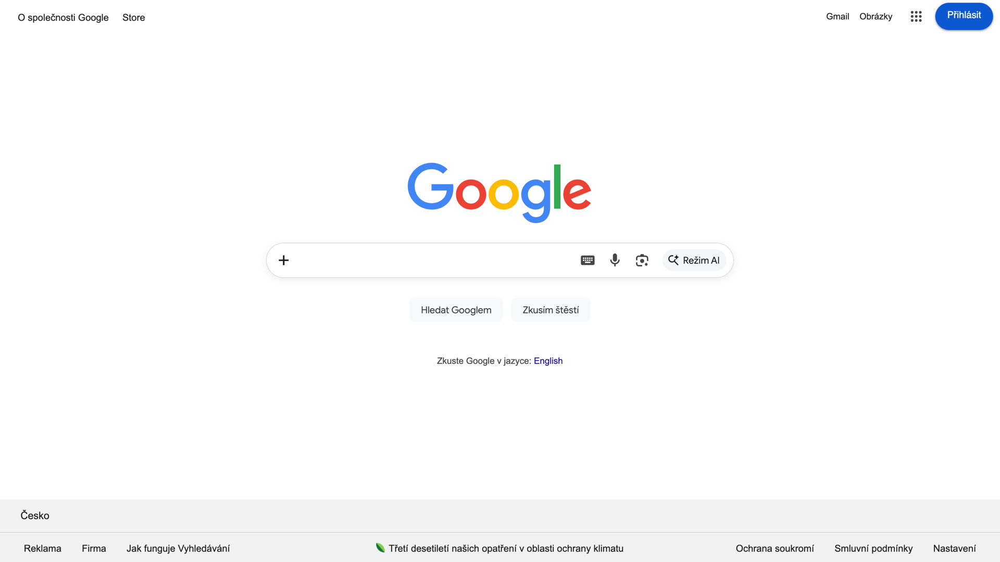

---

## One field, one action

Google works because it never asks you to decide anything before you can use it.

---

## Imagine if Google needed a tooltip

---

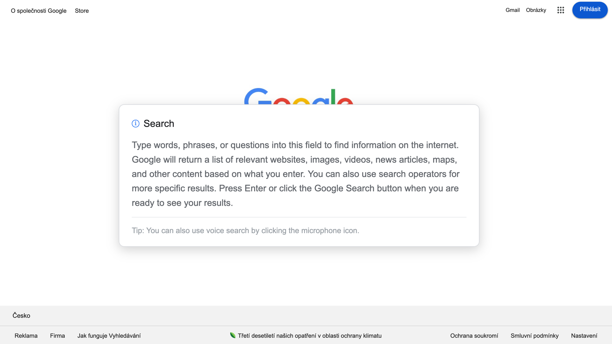

---

## Oh, that’s so much better. Thank you, I’m good.

---

## Every tooltip adds a decision

Every hidden label adds a question.
That’s Hick’s Law - the more choices, the longer it takes.

The best copy gives you immediate value. No hunting required.

---


---

## Documentation, not a tooltip

The tooltip said: URLs to start with
The label said: Start URLs

The tooltip added one thing: `startUrls`. A JSON field name for developers.
That’s documentation. Not a tooltip.

The label wasn’t done. The tooltip was covering for it.

---

## Constraint forces creativity

If you can’t hide it, you have to design it.

---

## Where’s Log out? Oh, Sign out. But I logged in

---

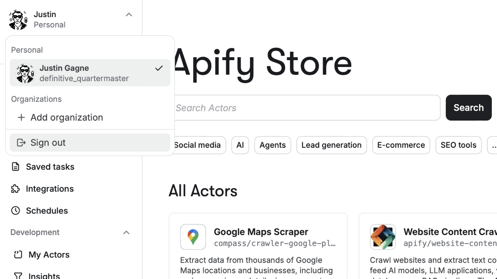

---

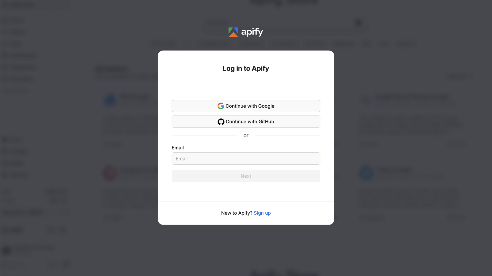

---

## `console.apify.com/sign-in`

- The URL says: `sign-in`
- The modal says: Log in to Apify
- The menu says: Sign out

Three words for the same session. Nobody agreed, not even in the URL.

---

## URL design is UI copy too

If someone can guess the URL, you have something good. `console.apify.com/sign-out`. Nobody tried.

---

## Find one signal

You’ve seen copy that stops, confuses, and goes missing. Find one example.

- a heading
- a button
- a label
- a tooltip
- an error message

**Take 5 to 10 minutes. Then we’ll share.**

You don’t need a diagnosis, just a finding.

---

## Recognize this pattern?

- You added a tooltip.
- Because the label wasn’t done yet.
- And the tooltip became the label.

---

> **Get to the point, don’t add fluff, and give them immediate value.**
>
> — Apify style guide

---

**Diagnostic:** If you need to explain the label, the label isn’t done yet.

---

## Copy is signal

- Copy that stops you
- Copy that confuses you
- Copy that needs care
- Copy that’s missing

Whenever copy feels broken, ask what it’s telling you. The answer is usually upstream.

---



---

## Copy that, resources

**UX and copy**
- [Content Guide](https://guides.18f.gov/content-guide/) by 18F
- [Placeholders in Form Fields Are Harmful](https://www.nngroup.com/articles/form-design-placeholders/) by Nielsen Norman Group
- [In Loving Memory of Square Checkbox](https://tonsky.me/blog/checkbox/) by Nikita “Tonsky” Prokopov
- [URLs are UI](https://www.hanselman.com/blog/urls-are-ui) by Scott Hanselman
- [Mailbag: URLs as UI](https://unsung.aresluna.org/mailbag-urls-as-ui/) by Marcin Wichary

**Style guide**
- Apify style guide (The rules we already agreed to.)

---

## Copy that, laws

**UX laws behind each pattern**

- Copy that stops you: [Postel’s Law](https://lawsofux.com/postels-law/)
- Copy that confuses you: [Jakob’s Law](https://lawsofux.com/jakobs-law/)
- Copy that needs care: [Zeigarnik Effect](https://lawsofux.com/zeigarnik-effect/)
- Copy that’s missing: [Hick’s Law](https://lawsofux.com/hicks-law/)
- When you’re stuck: [Miller’s Law](https://lawsofux.com/millers-law/)

---

## Copy doesn’t lie

It just takes practice<br>
to hear what it’s saying.

*Thanks, díky, merci.*

`justin.gagne@apify.com`

---

<!-- End of deck -->
